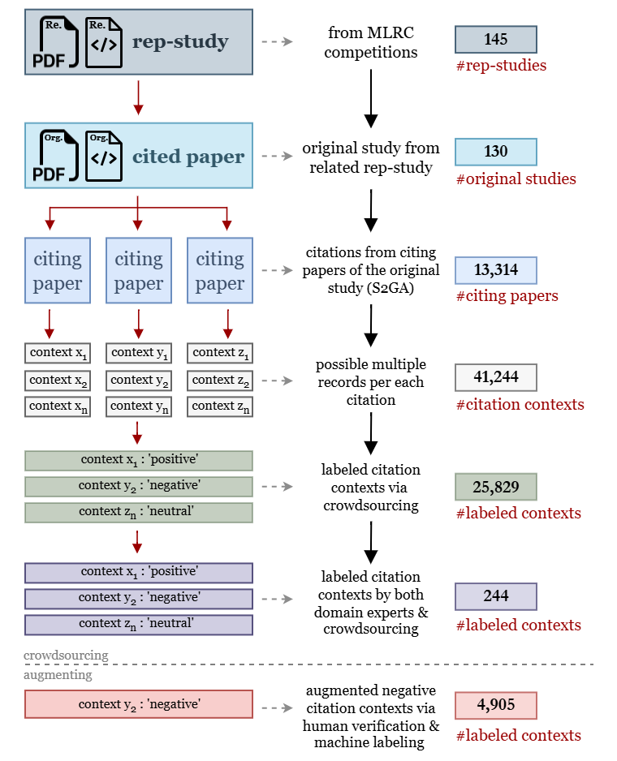

# CC30k: A Citation Contexts Dataset for Reproducibility-Oriented Sentiment Analysis 

This repository contains the files and code we used to prepare the CC30k: A Citation Contexts Dataset for Reproducibility-Oriented Sentiment Analysis. This is an extended work of our initial project [<b>"Can citations tell us about a paper’s reproducibility? A
case study of machine learning papers"</b>](https://github.com/lamps-lab/ccair-ai-reproducibility).

## Folder structure 
```
    .
    ├── dataset           # All the data files required to reproduce the results
    ├── figures           # Visualizations stored location
    ├── labeling-gui      # GUI used for crowd-sourcing
    ├── notebooks         # .ipynb notebook files
    └── README.md
```

## Dependencies ##
All the required dependencies included in the `requirements.txt` file. 

* torch==1.13.0
* transformers==4.39.1
* pandas==2.0.3
* beautifulsoup4==4.12.2
* Selenium==4.11.2
* webdriver-manager==4.0.0
* bibtexparser==1.4.0
* pdfminer.six
* ipykernel==6.26.0
* openpyxl==3.1.2
* matplotlib==3.8.0

## Dataset ##
The CC30k dataset consists of labeled citation contexts obtained through crowdsourcing. Each context is labeled by three independent workers. This README describes the structure and columns of the dataset.

Available in the `dataset` directory



### Dataset Description

The CC30k dataset is unique in its focus on **reproducibility-oriented sentiments (ROS)** within scientific literature. This introduces a novel approach to studying computational reproducibility by leveraging citation contexts, which are textual fragments in scientific papers that reference prior work. This dataset comprises 30,829 labeled citation contexts from scientific literature published at AI venues, each annotated with one of three ROS labels: `positive`, `negative`, or `neutral`. These labels reflect the cited work's perceived reproducibility. The dataset contains ROS labeled contexts along with metadata about the workers, reproducibility study, related original paper, and citing paper, and the final aggregated labels. The columns in the dataset are detailed in the table below:  


| **Column Name**               | **Description** |
|---------------------------|------------|
| `input_index`            | Unique ID for each citation context. |
| `input_context`          | Citation context that workers are asked to label. |
| `input_file_key`         | Identifier linking the context to a rep-study. |
| `input_first_author`     | Name or identifier of the first author of the cited paper. |
| `worker_id_w1`          | Unique ID of the first worker who labeled this citation context. |
| `work_time_in_seconds_w1` | Time (in seconds) the first worker took to label the citation context. |
| `worker_id_w2`          | Unique ID of the second worker who labeled this citation context. |
| `work_time_in_seconds_w2` | Time (in seconds) the second worker took to label the citation context. |
| `worker_id_w3`          | Unique ID of the third worker who labeled this citation context. |
| `work_time_in_seconds_w3` | Time (in seconds) the third worker took to label the citation context. |
| `label_w1`              | Label assigned by the first worker. |
| `label_w2`              | Label assigned by the second worker. |
| `label_w3`              | Label assigned by the third worker. |
| `batch`                 | Batch number for the posted Mechanical Turk job. |
| `majority_vote`         | Final label based on the majority vote among workers’ labels. |
| `majority_agreement`    | Indicates how many of the three workers agreed on the final majority vote. |
| `rs_doi`               | Digital Object Identifier (DOI) of the reproducibility study paper. |
| `rs_title`             | Title of the reproducibility study paper. |
| `rs_authors`           | List of authors of the reproducibility study paper. |
| `rs_year`              | Publication year of the reproducibility study paper. |
| `rs_venue`             | Venue (conference or journal) where the reproducibility study was published. |
| `rs_selected_claims`   | Number of claims selected from the original paper for reproducibility study (by manual inspection). |
| `rs_reproduced_claims` | Number of selected claims that were successfully reproduced (by manual inspection). |
| `reproducibility`      | Final reproducibility label assigned to the original paper by manual inspection (*reproducible, not-reproducible, partially-reproducible* [if 0 < `rs_reproduced_claims` < `rs_selected_claims`]). |
| `org_doi`              | DOI of the original (cited) paper that was assessed for reproducibility. |
| `org_title`            | Title of the original (cited) paper. |
| `org_authors`          | List of authors of the original (cited) paper. |
| `org_year`             | Publication year of the original (cited) paper. |
| `org_venue`           | Venue where the original (cited) paper was published. |
| `org_paper_url`        | URL to access the original (cited) paper. |
| `org_citations`        | Number of citations received by the original (cited) paper. |
| `citing_doi`          | DOI of the citing paper that cited the original (cited) paper. |
| `citing_year`         | Publication year of the citing paper. |
| `citing_venue`        | Venue where the citing paper was published. |
| `citing_title`        | Title of the citing paper. |
| `citing_authors`      | List of authors of the citing paper. |


## Jupyter Notebook Descriptions ##

Available inside `notebooks` directory.

- **R001_AWS_Labelling_Dataset_Preprocessing_Mturk.ipynb**
	- Used to pre-process data for Mechanical Turk (MTurk) labeling.

- **R001_AWS_MTurk_API.ipynb**
	- Used to communicate with MTurk workers.

- **R001_AWS_MTurk_process_results.ipynb**
	- Used to process crowd-sourced results from MTurk.

- **R_001_Creating_the_RS_superset.ipynb**
	- Used to collect the original and reproducibility studies.

- **R_001_Extract_Citing_Paper_Details.ipynb**
	- Used to collect citing paper details and contexts using the Semantic Scholar Graph API (S2GA).

- **R_001_MTurk_Sentiment_Analysis_5_models.ipynb**
	- Generates the performance measures for the selected five open-source multiclass sentiment analysis models.

<!-- ## Citation ## -->

```BibTeX

```

```
Rochana R. Obadage
08/18/2025
```